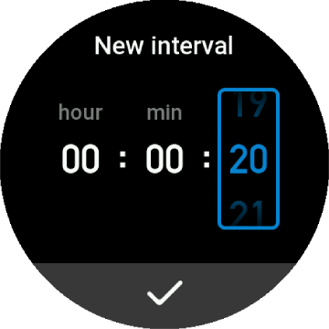
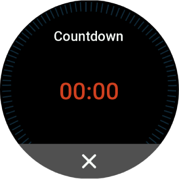

# Timer Application for [ZEPP OS](https://docs.zepp.com/docs/intro/) devices

Timerr is a simple and convenient app that will help you with your workouts.
Set the timer to a specific time and interval, and the app will notify you of each interval.
This is ideal for exercises like stretching, Pilates, yoga, and others, when you need to perform exercises with repetitions for the left and
right sides of the body.
The timer can also be used to track the time between sets in strength training.
The app has a simple and intuitive interface, close to the system one.

Key features: **#Interval notifications** **#Fitness-oriented** **#Easy to use**

Currently supported:

Models:

- T-REX Ultra (circular screen, 454px)

Languages:

- en-US
- ru-RU

## Quick start

- Select timer

  
- Or create new timer

  
- Select interval

  
- Or create new interval

  
- Timer progress with interval notifications

  
- End

  
