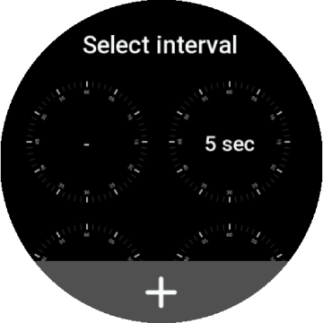
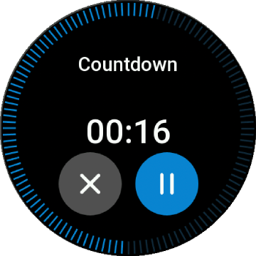

# Timer Application for [ZEPP OS](https://docs.zepp.com/docs/intro/) devices

## Table of Contents
1. [Description](#description)
2. [Quick start](#quick-start)
3. [Privacy Statement](#privacy-statement)
4. [Permissions](#permissions)

### Description

Service category: Common

App classification: Utilities

App introduction: Timer with interval notifications

Timerr is a simple and convenient app that will help you with your workouts.
Set the timer to a specific time and interval, and the app will notify you of each interval.
This is ideal for exercises like stretching, Pilates, yoga, and others, when you need to perform exercises with repetitions for the left and
right sides of the body.
The timer can also be used to track the time between sets in strength training.
The app has a simple and intuitive interface, close to the system one.

Key features: **#Interval notifications** **#Fitness-oriented** **#Easy to use**

#### Currently supported:

Devices with round or square screens, with Zepp OS 3.0 or higher

##### Languages:

- en-US
- ru-RU

### Quick start

- Select timer

  
- Or create new timer

  
- Select interval

  
- Or create new interval

  
- Timer progress with interval notifications

  
- End

  

### Privacy Statement

We collect only device-specific information, such as the shape and size of your screen, to improve usability of the app.
We **do not collect** any personal information, and **do not share** any information with third parties.

We may make changes to this privacy statement from time to time. To stay up-to-date on the latest changes, please review this statement
periodically.

### Permissions

- Getting device info
- Local storage
